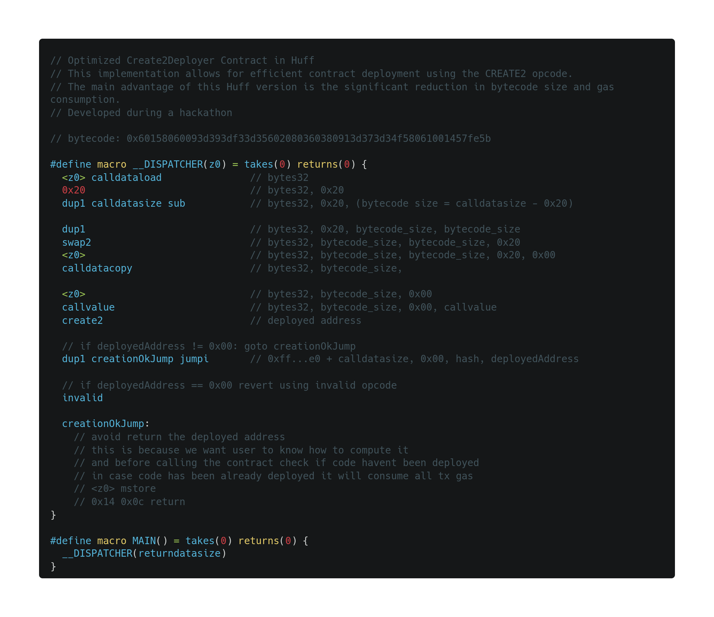

# `Create2Deployer`

## Contenido del Repositorio

- **Carpeta [`/create2deployer`](./create2deployer/):** Aquí encontrarás el código y los tests de la nueva implementación del contrato Create2Deployer. Esta implementación ha sido realizada utilizando el framework Foundry. Para más detalles, dirígete a la carpeta y consulta el `README` específico de esa sección.

## Contribuciones y Feedback

Agradecemos cualquier feedback o contribución al proyecto. Si encuentras algún problema o tienes alguna sugerencia, no dudes en abrir un issue o enviar un pull request.

## Licencia

MIT

## Deployments

LaChain testnet | 274 | [0xF546cA6213E8EfB7f3e1c29CdF05721522f7178B](https://testexplorer.lachain.network/address/0xF546cA6213E8EfB7f3e1c29CdF05721522f7178B)